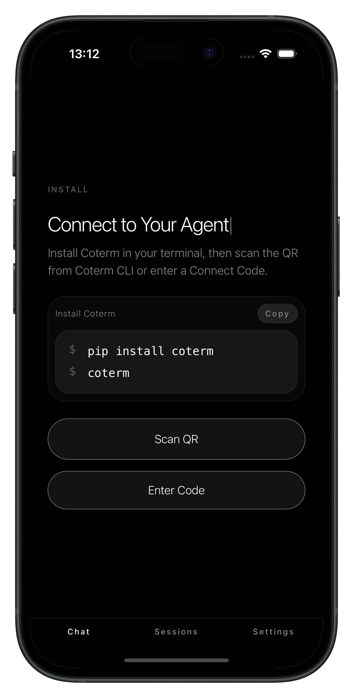

# Coterm

[English](#english) | [中文](#中文)

<p align="center">
  
</p>

---

## English

**Your terminal, now mobile.**

Coterm lets you start an AI coding session in your terminal and continue from your phone.  
Run `coterm` on your laptop, scan a code with the iPhone app, and keep the session with you.

### Why

Coding life is no longer tied to one desk.

You may be in a cafe, between meetings, on a train, or living the digital nomad version of life in Chiang Mai. Your terminal is still where real work happens, but your phone is what stays with you.

Coterm is built for that gap:

- start locally, where your code and tools already live
- stay connected from your phone
- approve actions, read progress, and reply without reopening the laptop every time

### How It Works

1. Install Coterm in your terminal.
2. Run `coterm`.
3. Scan the QR code with the iPhone app.
4. Keep working from your laptop while your phone becomes the companion view.

```bash
pip install coterm
coterm
```

The current mobile flow is intentionally simple:

- open the app
- scan the code or enter a connect code
- jump into the session

### What Coterm Is

Coterm has three simple pieces:

- **CLI**  
  Starts the session in your local terminal.
- **Hub**  
  Keeps the session reachable from other devices.
- **iPhone app**  
  Lets you read, reply, and approve on the go.

Today, the default experience is:

- install the CLI with `pip`
- connect to the default hosted hub
- pair with the iPhone app

If you want, you can still point Coterm to your own Hub.

### Who It’s For

Coterm is for people who already work in the terminal and want something simpler than remote desktop on a phone.

It is especially good for:

- solo builders
- indie hackers
- founders who code
- remote developers
- anyone who wants to keep an eye on a live coding session without babysitting a laptop

### Current Focus

Coterm is focused on one thing:

**make the terminal session feel portable, not heavy.**

So the product direction is intentionally simple:

- fast startup
- clear pairing
- mobile companion first
- no giant dashboard required

### Repo

This repository is the full Coterm workspace:

- [`coterm/`](./coterm)  
  CLI runtime and packaging
- [`coterm-hub/`](./coterm-hub)  
  Hub service
- [`coterm-client/`](./coterm-client)  
  iPhone app and web client work
- [`docs/`](./docs)  
  technical design notes

### Start

If that sounds like your kind of workflow, start with:

```bash
pip install coterm
coterm
```

---

## 中文

**把你的终端，带在身上。**

Coterm 让你在终端里启动 AI 编程会话，然后在手机上继续看、继续管、继续回复。  
你在电脑上运行 `coterm`，用 iPhone 扫码，就能把这段会话带走。

### 为什么做

真正的开发环境还在电脑上，  
但人已经不总在电脑前了。

也许你在咖啡馆、在路上、在开会之间，  
也可能是在清迈过数字游民生活。

Coterm 想解决的就是这个很现实的问题：

- 真正执行，还是在你的终端里
- 但会话可以跟着你走
- 你可以在手机上查看进度、回复消息、处理授权

### 怎么用

1. 在终端安装 Coterm
2. 运行 `coterm`
3. 用 iPhone App 扫码连接
4. 电脑继续干活，手机负责陪你一路跟着

```bash
pip install coterm
coterm
```

当前移动端的目标不是做一套复杂后台，而是尽量轻：

- 打开 App
- 扫码或输入连接码
- 直接进入会话

### Coterm 是什么

Coterm 目前由三部分组成：

- **CLI**
  在你的本地终端里启动会话
- **Hub**
  让这段会话可以被其他设备连接
- **iPhone App**
  让你在移动中查看、回复和授权

当前默认体验是：

- 用 `pip` 安装 CLI
- 连接默认托管节点
- 用 iPhone App 配对

如果你愿意，也仍然可以把 Coterm 连接到你自己的 Hub。

### 适合谁

Coterm 适合这几类人：

- 本来就习惯在终端里工作的开发者
- 独立开发者
- 会写代码的创业者
- 远程团队成员
- 不想每次都重新掏出电脑，只想随时看一眼会话的人

### 当前重点

当前阶段，Coterm 只专注一件事：

**让终端会话变得可随身，而不是变复杂。**

所以产品会刻意保持克制：

- 启动快
- 配对清楚
- 先把移动端陪伴体验做好
- 不先做一大堆厚重后台

### 仓库结构

这个仓库包含 Coterm 的完整工作区：

- [`coterm/`](./coterm)
  CLI 与运行时
- [`coterm-hub/`](./coterm-hub)
  Hub 服务
- [`coterm-client/`](./coterm-client)
  iPhone App 和 Web 客户端
- [`docs/`](./docs)
  技术设计文档

### 开始

如果这正是你想要的工作方式，就从这里开始：

```bash
pip install coterm
coterm
```
